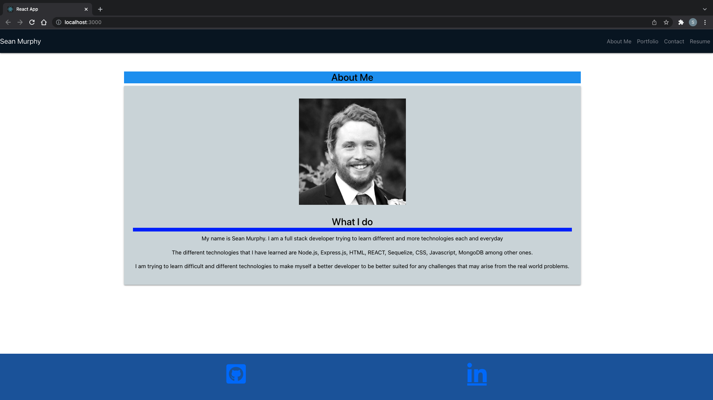

# REACT Portfolio

## Description

This project is a portfolio using the REACT library. I first started using Bootstrap at the beginning, but then I went over to the Materialize CSS framework to learn more about the two together. There was a difference in trying to blend the two together and learning from the differences and what would make it work. 

The portfolio has four separate sections: About Me, Portfolio, Contact and Resume. They have links to their own pages when clicked on and it is only that portion that is shown on the page at the time. Allowing each of the components for the webpage to have their own page allows them to really shine. Compared to having everything on one page where you may have different styles. 

## Table of Contents
 * [Usage](#usage)
 * [Technologies](#technologies)
 * [Links](#links)
 * [Credit](#credit)

## Usage

To view my resume, just click the link down below!

## Technologies
 * REACT.js
 * Javascript
 * Materialize
 * CSS
 * Bootstrap

## Links
 * [Deployed Application](https://smurphy7326.github.io/good-react-portfolio/)
 * [Github Repository](https://github.com/smurphy7326/good-react-portfolio)

 ## Credit
* UCONN Coding Bootcamp
* Materialize https://materializecss.com/
* Den for Geeks https://www.geeksforgeeks.org/
* REACT https://reactjs.org/

